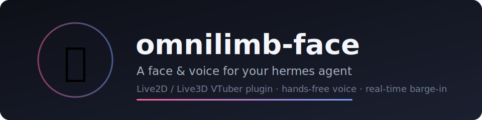
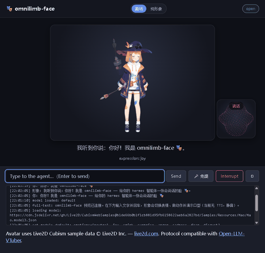
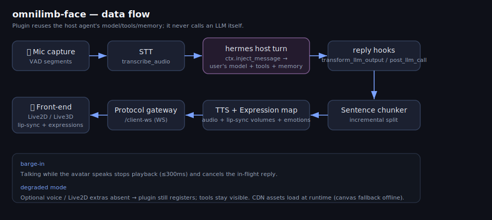

# omnilimb-face



[English](README.md) · **中文**

一个独立、可安装的 [hermes-agent](https://github.com/NousResearch) 插件,给你的
智能体一张**会说话的脸**:语音免提交互(VAD + STT)、实时打断(barge-in)、以及带
口型同步与表情驱动的 Live2D / Live3D 形象 —— 全程**不修改 hermes 任何核心文件**,
仅通过 `register(ctx)` 扩展面集成。隶属 [omnilimb](https://github.com/seanyang1983/omnilimb) 家族。

## 演示

上方是虚拟形象,会带着口型与表情说出智能体的回复;下方是对话框,你可以打字(或说话)。



> 上图为合成预览(`python preview.py`)效果;静态截图见
> [`docs/assets/screenshot.png`](docs/assets/screenshot.png)。
> 形象:Live2D Cubism 示例 **"Mao" © Live2D Inc.**(从 CDN 加载,不打包 ——
> 见[致谢](#致谢与第三方授权))。

> 📖 **完整文档见 [`docs/GUIDE.md`](docs/GUIDE.md)** —— 介绍 / 架构 / 安装 / 配置 /
> 命令(CLI·斜杠·工具)/ Live2D·Live3D 切换 / 实时打断(barge-in)/ 故障排查 / 开发测试。
>
> 🎭 **形象深度整合见 [`docs/AVATAR_INTEGRATION.md`](docs/AVATAR_INTEGRATION.md)** ——
> Live2D/Live3D 表情·动作·口型**怎么绑定**、**怎么导入新模型**(Cubism / VRM),以及
> 后续 2D+3D **深度融合开发**方向。

## 工作原理

插件复用 hermes 现有系统,不自带模型配置:转写经 `ctx.inject_message` 注入,宿主
智能体的正常轮次产生回复(用你当前的模型、工具与记忆),再通过 `transform_llm_output`
/ `post_llm_call` 钩子拦截回复文本来驱动 TTS 和形象。语音转写复用 `stt` 配置段,
语音合成复用 `tts` 配置段。插件**从不自己调用 LLM**,所以形象说出的永远是你所配置
智能体的真实回答。



## 上手指南

需要 **Python 3.11+**。下面两条路径任选其一,每步都写清楚了。

### 方式 A —— 一分钟预览(无需 hermes-agent)

```bash
# 1) 一条命令装齐所有东西(含 Edge-TTS 语音,这样你能听到声音)
pip install -e ".[all]"
# 2) 启动预览(它同时提供网页和网关)
python preview.py
# 3) 浏览器打开网页:
#       http://127.0.0.1:12394/      <-- 网页在这里
```

在页面里打字,形象就会用中文语音回应 + 对口型 + 切表情。
(先点一下页面或打个字 —— 浏览器要求有用户手势后才允许播放声音。)

> ⚠️ **网页是 12394 端口,不是 12393。** 12393 是 WebSocket **网关**
> (`ws://…/client-ws`),用浏览器打开 `http://127.0.0.1:12393/` 是**打不开**的。
> 网页在 `网关端口 + 1` = **12394**。(单端口模式 `python preview.py --single-port` /
> `--https` 下,网页和网关才共用 12393。)

### 方式 B —— 完整形态(在 hermes 里聊天,形象说出真实回复)

```bash
# 1) 一条命令装进 hermes 的 venv,所有东西都包含
<hermes-venv>/python -m pip install -e "path/to/omnilimb-face[all]"
# 2) 启用:在 ~/.hermes/config.yaml 的 plugins.enabled 里加 `omnilimb-face`
# 3) 运行 hermes —— 它会起网关(12393)+ 前端(12394)
hermes
hermes vtuber status                 # 检查形象子系统是否就绪
# 4) 打开 http://127.0.0.1:12394/ ,然后在 hermes 终端里聊天 ——
#    形象会逐句说出回复,带口型 + 表情。
```

合成优先用宿主的 `text_to_speech` 工具,没有则用无密钥的 Edge-TTS 兜底(默认中文音色,
把 `tts.<provider>.voice` 设为 Edge `*Neural` 音色即可更换)。`/client-ws` 网关同时兼容
websockets 12.x 与 13–15.x。

### 更精简的安装(可选)

`[all]` 会装齐一切。若想体积更小,只装你需要的部分即可 —— 不装这些时**核心**会以
**降级**状态运行(仍会注册,工具在 `hermes tools` 中可见):

```bash
pip install -e ".[voice]"      # 麦克风采集 + VAD(免提)
pip install -e ".[wakeword]"   # 可选唤醒词
pip install -e ".[live2d]"     # 前端静态资源服务
pip install -e ".[preview]"    # preview.py 用的 Edge-TTS 语音 + 本地 STT
pip install -e ".[dev]"        # 测试工具
```

### 在 hermes 中启用

通过 `hermes_agent.plugins` pip 入口点发现,或把目录放到
`~/AppData/Local/hermes/plugins/omnilimb-face/`。在 `config.yaml` 的 `plugins.enabled`
中加入 `omnilimb-face` 即可启用。

### 手机端支持

形象与语音免提在手机上也能用。由于浏览器只在安全上下文(HTTPS)下才允许访问麦克风,
预览可在局域网内用**自签证书以 HTTPS** 提供服务:

```bash
python preview.py --lan --https          # 在局域网 IP 上以 HTTPS 提供服务(单端口 12393)
# 或用 start.bat 的 3 / 4 选项(局域网 HTTPS,可选加 --llm --stt)
```

然后在手机(同一 Wi-Fi)打开 `https://<本机局域网IP>:12393/`,首次接受自签证书警告即可,
之后手机麦克风就能用了。生成证书需要 `[preview]` extra(`cryptography`)。

## 故障排查

- **`http://127.0.0.1:12393/` 打不开。** 那是 WebSocket **网关**,不是网页。请打开
  **`http://127.0.0.1:12394/`**(网关端口 **+ 1**)。
- **没有声音。** 装语音引擎:`pip install edge-tts`(或 `pip install -e ".[all]"`)。
  预览启动时显示 `voice: on (edge-tts …)` 才表示已启用。此外还需联网(Edge 在线语音)
  并先在页面里点一下/打个字(浏览器自动播放限制)。
- **装完了但没反应 / 看不到形象。** 安装只是装上代码,还得**启动**:`python preview.py`
  (方式 A)或 `hermes vtuber start`(方式 B),再打开 `http://127.0.0.1:12394/`。
- **形象不出现。** Live2D 模型从 CDN 加载 —— 检查网络;离线时会回退到无依赖的
  canvas 占位形象。

## 目录结构

```
omnilimb-face/
├── pyproject.toml          # 打包、钉版依赖、可选 extras、入口点
├── plugin.yaml             # PluginManifest(name/version/hooks/tools)
├── __init__.py             # 目录发现 shim —— 重导出 register
├── omnilimb_face/          # 插件包
│   ├── plugin.py           # register(ctx) 入口
│   ├── voice/              # 采集、VAD、唤醒词
│   └── protocol/           # /client-ws 事件模型 + 网关
└── tests/                  # pytest + Hypothesis(单元 / 属性 / 集成)
```

## 开发

```bash
pytest                                   # 运行测试套件
HYPOTHESIS_PROFILE=ci pytest             # 更重的属性测试
```

### 发版(维护者)

先在 `pyproject.toml` 里把 `version` 往上调,再用脚本发布:

```powershell
py -3.11 -m pip install --upgrade build twine   # 一次性安装工具
./release.ps1                                   # 构建 + 上传到 PyPI
./release.ps1 -TestPyPI                         # 先发到 TestPyPI 试水
./release.ps1 -SkipBuild                        # 只上传已有的 dist/
```

`release.ps1` 会从仓库**之外**的本地 `.env` 读取项目级 PyPI token
(`PYPI_API_TOKEN_FACE`),该文件永不提交。token 仅临时使用、且在所有输出中脱敏。
PyPI 不允许重复上传同一版本号,所以发版前务必先升 `version`。

## 许可

以 **GNU Affero 通用公共许可证 v3.0 或更新版本(AGPL-3.0-or-later)**发布 ——
见 [`LICENSE`](LICENSE)。

简而言之:你可以自由使用、研究、修改和分享本软件(**包括商业用途**),但如果你
**分发它、或把修改后的版本作为网络服务对外提供**,就必须同样以 AGPL 公开你的完整
对应源码 —— 以此保证每一个下游版本都保持开源。

**提供商业 / 专有授权。** 如果你希望在闭源或专有产品中使用 omnilimb-face、且不想
承担 AGPL 的源码公开义务,可单独购买商业授权 —— 见
[`COMMERCIAL-LICENSE.md`](COMMERCIAL-LICENSE.md) 或联系 **yase19636404@163.com**。

Copyright © 2025 seanyang1983。

### 致谢与第三方授权

本插件**不打包、不再分发**任何形象模型、Live2D Cubism Core 或第三方前端运行时,
全部仅在运行时经 CDN 加载(离线时回退到无依赖的 canvas 占位形象)。详见
[`NOTICE.md`](NOTICE.md) 与 [`THIRD_PARTY_NOTICES.md`](THIRD_PARTY_NOTICES.md)。

- **Open-LLM-VTuber** —— 这里的 `/client-ws` 协议是与
  [Open-LLM-VTuber](https://github.com/Open-LLM-VTuber/Open-LLM-VTuber) **兼容**的
  独立重写(截至 2026-06,其 v1.2.0 及之前为 MIT;license 变更说明见 `NOTICE.md`)。
  未拷贝任何上游源码。感谢该项目的协议设计。
- **Live2D Cubism 示例模型** —— 默认形象(`models/model_dict.json`)仅通过钉死 commit
  的 CDN URL 引用 Live2D 官方 Cubism 示例 **"Mao"**。Cubism Core 运行时为 Live2D Inc.
  专有,从 Live2D 的 CDN 加载,不打包。

  > This content uses sample data owned and copyrighted by Live2D Inc.(《Terms of
  > Use for Live2D Cubism Sample Data》/ Live2D Cubism SDK 许可 —— https://www.live2d.com/en/)。

  Live2D 官方示例对一般用户与小规模事业者(最近年销售额低于 1000 万日元)可免费商用/
  非商用;达到或超过该门槛的主体须遵守 Live2D 附加条款。**正式或规模化商用请在
  `models/model_dict.json` 中替换为你自有或已获授权的模型。**
- **pixi.js / pixi-live2d-display / three.js / @pixiv/three-vrm** —— 均为 MIT,CDN 加载。
- **可选 Python 依赖** —— `edge-tts`(`[preview]`,**GPL-3.0**,不打包)与
  `openWakeWord`(`[wakeword]`,库为 Apache-2.0,但其预训练模型为
  **CC-BY-NC-SA-4.0 / 非商用**)在商用时需注意。
